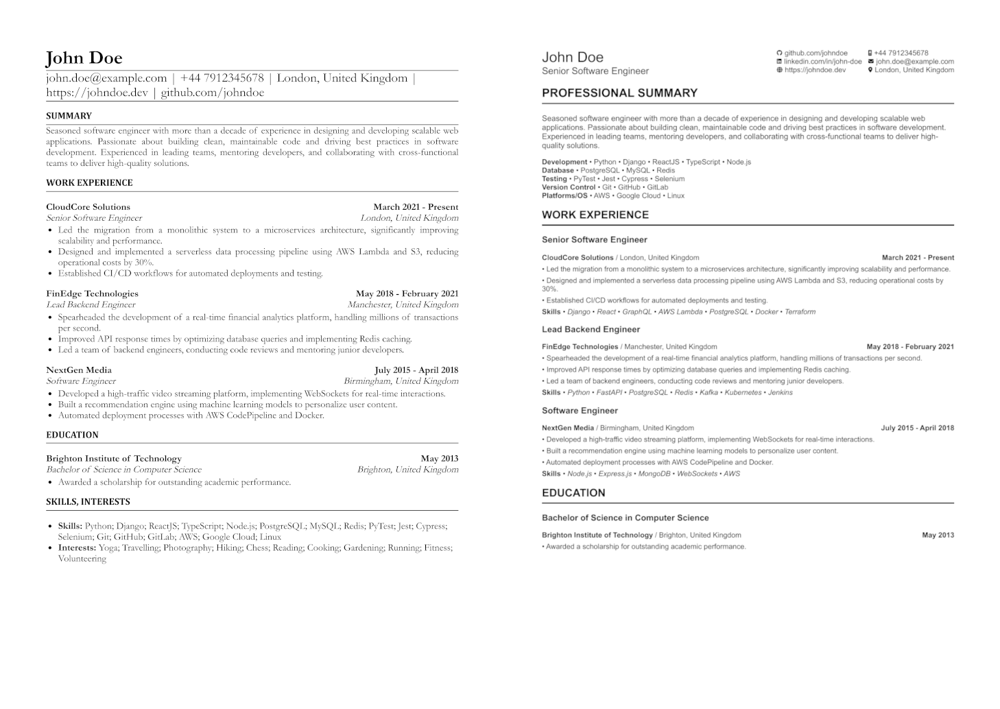

# 📃 Kamisaku

*Build a CV PDF from a yaml text file.*

[](https://badge.fury.io/rb/kamisaku)



See [examples](/examples) directory for sample generated PDF files based of [templates](/lib/templates).

## Usage

First we need to have a `yaml` file with the CV data. The yaml file supports following sections.

```yaml
version: 1
profile:
  name: # Your name
  title: # Your current job title
  about: # Some sleek details about your experience

contact:
  github: # Github username
  mobile: # Mobile number
  email: # email address
  linkedin: # Linkedin username
  location:
    country: # country name
    city: # city name

skills:
  - area: # specific skill area you are specialized in
    items:
      - # sub item such as a technology you have the skill in under the specialized area

experiences:
  - title: # job title
    organisation: # Name of the place you worked
    location:
      city: # city name
      country: # country name
    from:
      month: # month number that you started
      year: # year number that you started
  # if following is not given, it is assumed you are still working
    to:
      month: # month number that you stopped
      year: # year number that you stopped
    skills:
      - # a short name for a specialized skilled you gained
    achievements:
      - # Things you have achieved or did

education:
  - institute: # name of the place you studied
    location:
      city: # city name
      country: # country name
    qualification: # name of the degree/diploma qualification
    field: # name of the field such as Computer Science
    from:
      month: # month number that you started
      year: # year number that you started
    # if following is not given, it is assumed you are still studying
    to:
      month: # month number that you stopped
      year: # year number that you stopped
    achievements:
      - # Things you have achieved or did
```

## Template
For a list of templates availble for CV generation, check the See [examples](/examples) directory where each directory name is a template name.

## Installation

This is a Ruby gem. So you can either install as a gem or clone the repo and use `bin/console` file run from terminal.

### Dependency Requirement
- Ruby 3.4.3
- Ensure that [Google Chrome](https://www.google.com/chrome/) is installed.
- Chrome must be accessible from the terminal as `google-chrome`.
  - Kamisaku uses Chrome's [headless mode](https://developer.chrome.com/docs/chromium/headless/) to generate PDF files.

Add this line to your application's Gemfile:

```ruby
gem 'kamisaku'
```

And then execute:
```bash
$ bundle install
```
Or install it yourself as:
```bash
$ gem install kamisaku
```

## Generating PDF

### Using terminal

Once you have the YAML text file, feed it into the `bin/console` and specify the output location.

```bash
bin/console -c examples/paper/john_doe.yml -o examples/paper/john_doe.pdf  -t paper
```

#### Bash options

- `-c` the YAML file
- `-o` output location for the PDF file including the name
- `-t` template to use

## Development

After checking out the repo, run `bin/setup` to install dependencies. Then, run `rake test` to run the tests. You can also run `bin/console` for an interactive prompt that will allow you to experiment.

To install this gem onto your local machine, run `bundle exec rake install`. To release a new version, update the version number in `version.rb`, and then run `bundle exec rake release`, which will create a git tag for the version, push git commits and the created tag, and push the `.gem` file to [rubygems.org](https://rubygems.org).

## Contributing

Bug reports and pull requests are welcome on GitHub at https://github.com/sinaru/kamisaku. This project is intended to be a safe, welcoming space for collaboration, and contributors are expected to adhere to the [code of conduct](https://github.com/[USERNAME]/kamisaku/blob/main/CODE_OF_CONDUCT.md).

## License

The gem is available as open source under the terms of the [MIT License](https://opensource.org/licenses/mit).

## Code of Conduct

Everyone interacting in the Kamisaku project's codebases, issue trackers, chat rooms and mailing lists is expected to follow the [code of conduct](https://github.com/[USERNAME]/kamisaku/blob/main/CODE_OF_CONDUCT.md).
